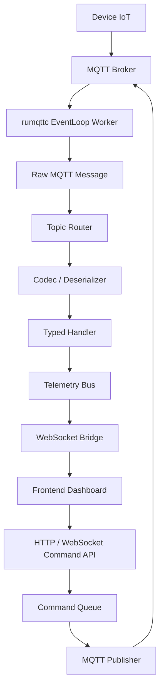
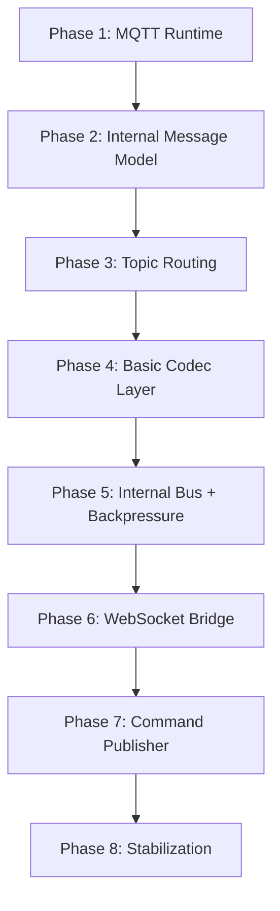
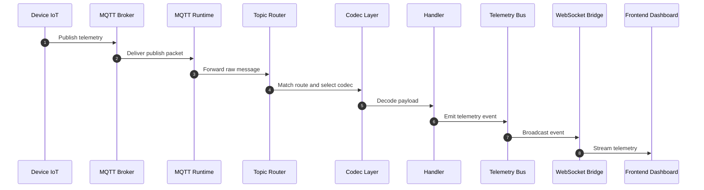
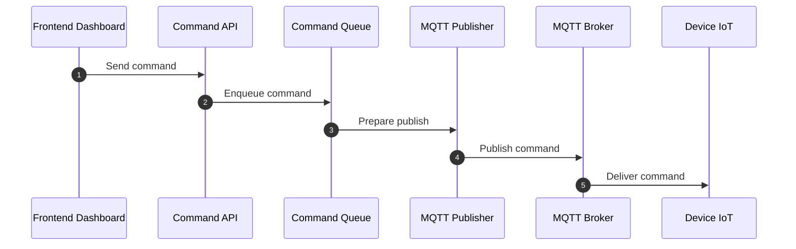

# Short-Term Roadmap Implementasi IoT Framework

## Rumqttc + Tokio + Salvo

---

## 1. Tujuan Short-Term

Membangun core framework minimum yang sudah bisa:

- Menjalankan MQTT runtime secara stabil.
- Menerima pesan dari device melalui MQTT.
- Menormalisasi pesan menjadi internal message.
- Melakukan routing berdasarkan topic MQTT.
- Melakukan deserialization payload berdasarkan route.
- Mendistribusikan event ke internal bus.
- Mengirim telemetry ke frontend melalui WebSocket.
- Mengirim command dari frontend/backend ke device melalui MQTT.
- Menangani backpressure dasar agar sistem tidak mudah overload.

---

## 2. Scope Short-Term

Yang termasuk:

- MQTT runtime wrapper.
- Auto-reconnect dan auto-resubscribe.
- Graceful shutdown.
- Raw message envelope.
- Dynamic topic routing.
- Basic codec layer.
- Internal bounded channel.
- Telemetry broadcast.
- Command queue.
- Salvo WebSocket bridge.
- Basic backpressure policy.

Yang belum menjadi prioritas:

- Multi-crate architecture.
- Plugin system.
- Macro.
- Full observability.
- Full test suite.
- Load testing.
- Advanced retry policy.
- Advanced authorization.
- Dead-letter pipeline kompleks.
- Multi-protocol adapter.

---

## 3. Diagram Arsitektur Short-Term



---

## 4. Prinsip Desain Short-Term

- Event loop MQTT harus ringan.
- Business logic tidak dijalankan langsung di event loop.
- Routing dilakukan sebelum deserialization.
- Codec dipilih berdasarkan route.
- Channel internal harus bounded.
- Telemetry dan command harus dipisahkan.
- Telemetry boleh lossy jika overload.
- Command tidak boleh silent drop.
- WebSocket client lambat tidak boleh mengganggu MQTT runtime.
- Fokus pada core yang berjalan dulu, bukan ekosistem lengkap.

---

## 5. Roadmap Fase Short-Term



---

## 6. Phase 1: MQTT Runtime

Target:

- Membuat wrapper di atas `rumqttc`.
- Menjalankan MQTT event loop di background task.
- Menyediakan lifecycle dasar koneksi MQTT.

Fitur:

- MQTT config wrapper.
- Event loop worker.
- Auto-reconnect.
- Auto-resubscribe.
- Graceful shutdown.
- Priority shutdown signal.

Output:

- Framework bisa connect ke broker.
- Framework bisa menerima publish packet.
- Framework bisa reconnect setelah koneksi putus.
- Framework bisa subscribe ulang setelah reconnect.
- Framework bisa shutdown dengan aman.

---

## 7. Phase 2: Internal Message Model

Target:

- Membuat format pesan internal yang tidak bergantung langsung pada type `rumqttc`.

Fitur:

- Raw MQTT message envelope.
- Metadata topic.
- Metadata QoS.
- Metadata retain flag.
- Payload mentah.
- Timestamp penerimaan.

Output:

- Pesan dari MQTT dapat diteruskan ke layer lain dalam format internal yang stabil.

---

## 8. Phase 3: Topic Routing

Target:

- Mencocokkan topic MQTT ke handler yang sesuai.

Fitur:

- Route registry.
- Topic filter.
- Wildcard `+`.
- Wildcard `#`.
- Topic params.
- Handler mapping.

Output:

- Framework bisa mendaftarkan route seperti:
    - `devices/+/telemetry`
    - `devices/+/status`
    - `devices/+/event/#`

Catatan:

- Gunakan Trie atau matcher sederhana yang mengikuti semantik MQTT.
- Hindari regex sebagai default.
- Routing dilakukan sebelum payload diparse.

---

## 9. Phase 4: Basic Codec Layer

Target:

- Melakukan decode payload berdasarkan route.

Fitur:

- JSON codec.
- Raw bytes fallback.
- Decode error handling dasar.
- Route-specific codec selection.

Output:

- Payload mentah dapat diparse menjadi typed payload sesuai kebutuhan handler.

Catatan:

- Jika decode gagal, pesan tidak boleh menyebabkan crash.
- Untuk short-term, cukup support JSON dan raw bytes terlebih dahulu.
- Binary codec dapat ditambahkan setelah core stabil.

---

## 10. Phase 5: Internal Bus + Backpressure

Target:

- Menyediakan jalur komunikasi internal antar-layer.

Fitur:

- Bounded channel untuk ingress.
- Broadcast channel untuk telemetry.
- Bounded command queue.
- Basic drop policy untuk telemetry.
- Basic reject policy untuk command.

Output:

- MQTT runtime, router, handler, WebSocket, dan publisher terpisah secara jelas.

Policy awal:

- Telemetry:
    - Gunakan bounded buffer.
    - Jika penuh, boleh drop data lama atau data baru sesuai kebutuhan.
- Command:
    - Gunakan bounded queue.
    - Jika penuh, return error ke caller.
    - Jangan silent drop.

---

## 11. Phase 6: Real-Time Web Bridge

Target:

- Mengalirkan telemetry dari internal bus ke frontend secara real-time.
- Mendukung lebih dari satu mekanisme streaming selain REST API biasa.

Fitur:

- WebSocket endpoint.
- Server-Sent Events/SSE endpoint.
- Subscribe ke telemetry bus.
- Stream event ke browser.
- Handle client disconnect.
- Handle slow client secara sederhana.
- Basic filtering berdasarkan device, topic atau event type jika diperlukan.

Output:

- Frontend dashboard bisa menerima telemetry real-time melalui WebSocket atau SSE.

Catatan:

- Gunakan Salvo.
- WebSocket dan SSE berada dalam satu layer: Real-Time Web Bridge.
- SSE cocok untuk stream satu arah.
- WebSocket cocok untuk komunikasi dua arah atau interactive stream
- Untuk short-term, SSE dapat dijadikan jalur default telemetry jika dashboard frontend hanya perlu menerima data.
- WebSocket digunakan jika frontend perlu:
    - mengirim command interaktif dua arah,
    - mengubah subscription secara dinamis,
    - menerima dan mengirim pesan dalam satu koneksi.
- Real-Time Bridge membaca dari internal bus, bukan langsung dari MQTT runtime.
- WebSocket/SSE client lambat harus memiliki policy backpressure.

---

## 12. Phase 7: Command Publisher

Target:

- Mengirim command dari frontend/backend ke device melalui MQTT.

Fitur:

- HTTP atau WebSocket command endpoint.
- Command validation dasar.
- Command queue.
- Encode command payload.
- Publish ke MQTT topic.
- Basic publish error handling.

Output:

- Frontend/backend bisa mengirim command ke device melalui broker MQTT.

Catatan:

- Command path dipisahkan dari telemetry path.
- Command queue harus bounded.
- Command gagal harus menghasilkan error yang jelas.

---

## 13. Phase 8: Stabilization

Target:

- Merapikan core agar bisa dipakai sebagai fondasi pengembangan berikutnya.

Fitur:

- Error type yang lebih jelas.
- Logging dasar.
- Konfigurasi kapasitas channel.
- Konfigurasi route.
- Konfigurasi reconnect.
- Konfigurasi backpressure.
- Dokumentasi singkat penggunaan internal.

Output:

- Core framework cukup stabil untuk dijadikan baseline sebelum masuk long-term roadmap.

---

## 14. Diagram Alur Telemetry



---

## 15. Diagram Alur Command



---

## 16. Minimal Module Layout

```text
src/
├── mqtt/
│   ├── runtime
│   ├── publisher
│   └── subscription
├── message/
│   └── envelope
├── router/
│   ├── route
│   └── matcher
├── codec/
│   ├── json
│   └── raw
├── bus/
│   ├── telemetry
│   └── command
├── web/
│   ├── websocket
│   └── command_api
├── config/
└── error/
```

---

## 17. Prioritas Implementasi

Urutan kerja yang disarankan:

1. Stabilkan MQTT runtime.
2. Buat raw message envelope.
3. Buat ingress channel dari MQTT runtime ke processor.
4. Buat topic router sederhana.
5. Tambahkan JSON codec.
6. Hubungkan router ke typed handler.
7. Tambahkan telemetry bus.
8. Tambahkan WebSocket bridge.
9. Tambahkan command queue.
10. Tambahkan MQTT publisher.
11. Tambahkan basic backpressure.
12. Rapikan config dan error handling.

---

## 18. Kriteria Selesai Short-Term

Short-term roadmap dianggap selesai jika:

- MQTT runtime bisa connect ke broker.
- MQTT runtime bisa reconnect.
- MQTT runtime bisa auto-resubscribe.
- Shutdown berjalan aman.
- Pesan MQTT bisa masuk sebagai raw internal message.
- Topic bisa dicocokkan ke route.
- Payload JSON bisa diparse berdasarkan route.
- Handler bisa menerima typed payload.
- Handler bisa mengirim telemetry ke internal bus.
- WebSocket bisa mengirim telemetry ke frontend.
- Frontend/backend bisa mengirim command ke device.
- Channel internal bounded.
- Telemetry overload tidak menyebabkan OOM.
- Command queue penuh menghasilkan error yang jelas.

---

## 19. Batasan Short-Term

Batasan yang diterima untuk tahap awal:

- Fokus pada satu web framework terlebih dahulu.
- Fokus pada JSON codec terlebih dahulu.
- Fokus pada satu broker MQTT untuk development.
- Belum perlu plugin system.
- Belum perlu macro.
- Belum perlu multi-crate.
- Belum perlu full metrics.
- Belum perlu load testing lengkap.
- Belum perlu authorization kompleks.
- Belum perlu persistent queue.

---

## 20. Ringkasan

Short-term roadmap ini berfokus pada core minimum yang harus berjalan lebih dulu:

- MQTT runtime stabil.
- Raw message model.
- Topic routing.
- Route-specific decode.
- Internal bus.
- Basic backpressure.
- WebSocket telemetry bridge.
- Command publisher path.

Setelah semua bagian ini stabil, framework dapat dilanjutkan ke roadmap long-term seperti multi-crate architecture,
observability penuh, plugin system, macro, advanced testing, dan production hardening.